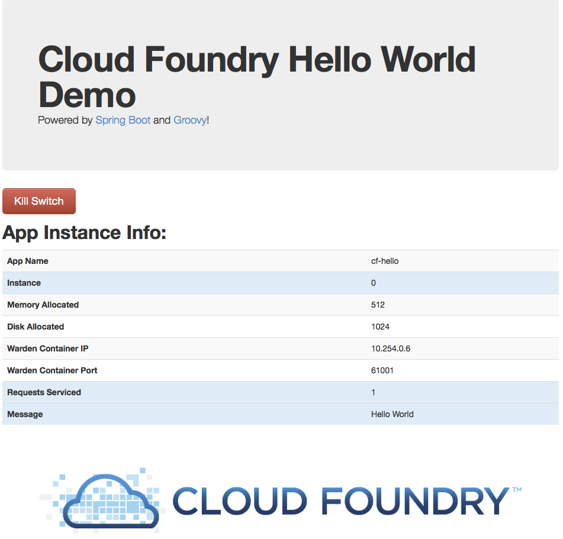

= cf-hello

Demonstrate application instance installation and scaling on Cloud Foundry with this simple (one Groovy file, one HTML file) Spring Boot CLI application!

== Running on Cloud Foundry

----
$ cf push
----

== SCALE!

----
$ cf scale cf-hello -i 5
----

(_or some reasonable number for your CF cloud!_)

== What you get:

